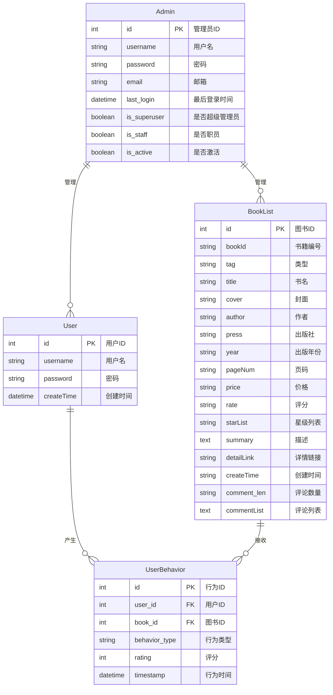

# 豆瓣图书系统ER图

## 实体说明

1. **User (用户)**
   - 普通用户实体，包含基本用户信息
   - 可以对图书进行浏览、评分、收藏等操作

2. **BookList (图书)**
   - 图书实体，包含图书的详细信息
   - 包括书籍基本信息、评分信息和评论信息

3. **UserBehavior (用户行为)**
   - 记录用户与图书之间的交互行为
   - 包括浏览、评分、收藏、点击等行为类型

4. **Admin (管理员)**
   - 系统管理员实体，负责管理系统
   - 具有对用户和图书的管理权限

## 关系说明

1. 用户可以对多本图书产生多种行为（一对多关系）
2. 图书可以被多个用户进行多种操作（一对多关系）
3. 管理员可以管理多个用户和多本图书（一对多关系）